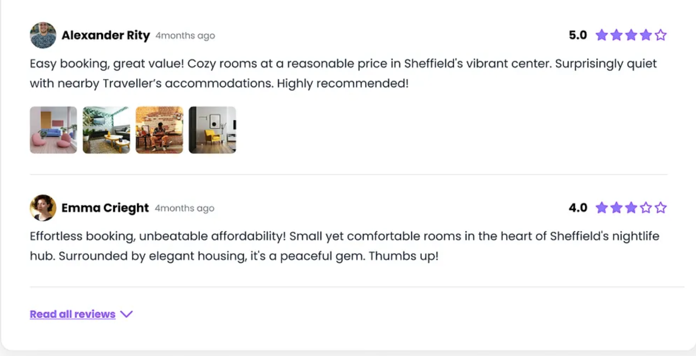

# Role  
You are an expert React/Next.js developer specializing in e‑commerce UIs with Tailwind CSS.

## 1. Typography
For the `howToUse` and `ingredients` sections :
- Change the **font family** of all text inside these sections to **Maven Pro**.  

## 2. Review section redesign and responsiveness

### Current issues
- The current **review section is not responsive** and does not look good on mobile or tablet.  
- I don’t like the current design and have provided an example image for reference.  

### New design requirements

- **Design the review section** so it visually matches the layout and feel of the uploaded image 
- Make sure the section is **fully responsive** (desktop, tablet, mobile) with:
  - Proper spacing and wrapping  
  - Mobile‑friendly typography and button sizes  

### Trust‑worthy review badge

- Add an **“Authorized” badge** (or text) to each review to make it feel more trustworthy to users.  
  - Example: a small badge or label near the reviewer name that says “Authorized” or “Verified”.  
  - Use a subtle but clear visual style (e.g., outlined badge, soft background, distinct color from main text).  

### Review form in modal

- Add a **“Write a review” button** (or similar) on the product page near the reviews.  
- When the user clicks this button:
  - Open a **modal** (not a new page) containing the review form.  
  - The form should include:
    - Star rating  
    - Review text  
    - reviewer name 
    - images
- The modal should:
  - Be responsive  
  - Close cleanly on “Cancel” or by clicking outside  
  - Show validation errors clearly  

### Admin review management

- In the **admin dashboard** (reviews section):
  - Add the ability for the admin to **edit existing customer reviews** (title, text, rating, status, etc.).  
  - Add the ability for the admin to **manually add a new review** for any product (similar to the user form).
  - admin can create fake reivews for any products  
  - Ensure that:
    - Changes are saved correctly in the database and reflect immediately on the frontend (after page reload or when fetched).

---

Do not break the existing layout and behavior of the rest of the page unless you must to make this section responsive.  
Make minimal but sufficient changes to CSS and components, and keep the code clean and consistent with the existing Tailwind patterns.  